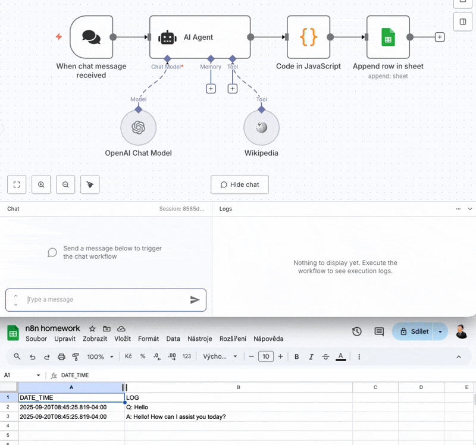

# Lesson 2: Demonstrating the n8n Framework

This lesson shows how to use n8n automation with:
- an AI agent,
- a tool,
- and a database.

## Solution
A simple workflow was created for this purpose:
1. The first node is a chatbot that receives the user's input.
2. The second node is an AI agent, connected to both Wikipedia (as a tool) and the language model.
3. The agent produces a JSON output, which is processed by another node using JavaScript to convert it into a clean JSON format.
4. Finally, a Google Sheets node writes the two elements of the collection as two new rows in a spreadsheet.

File structure:
- `src/workflow.json` – exported workflow from n8n

## Example
Input: When was the Holy Roman Emperor Charles IV born?  
Output: Two new records are added to the sheet below.

---

## License
This repository is licensed under the [MIT License](LICENSE)
